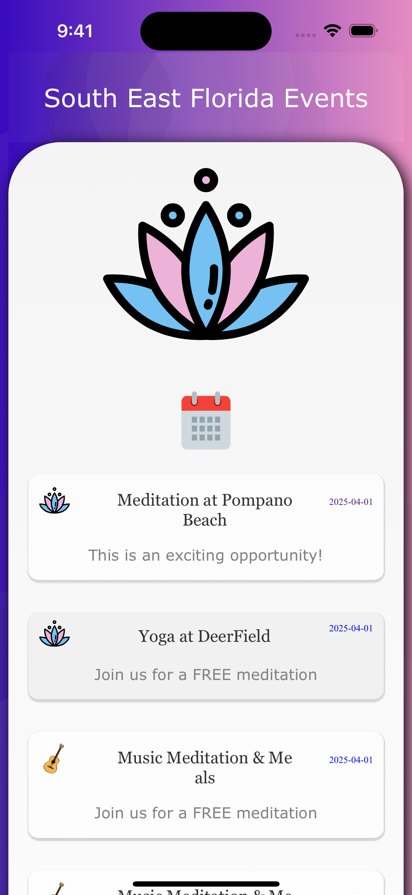
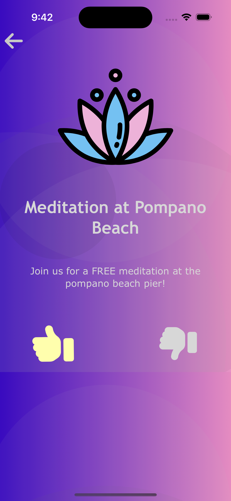

# Eventful SEFL

    
    

  

## Table of Contents
* [About](#about)
* [Screenshots](#screenshots)

## About 
### AI Powered Events Calendar for the Art of Living community in South East Florida to keep track of the latest events and activities.

 Purpose of the app is to list the ongoing activities & events in the area to allow people to RSVP & receive notification reminders. 
    Currently there is very low visibility on events happening and according to user interests and location. 

 Features a simple interface to quickly look up ongoing events & select a thumbs up / thumbs down for RSVP 

 
    <li> Application of Recommender System algorithms to showcase the events that are more conforming to user preferences. </li>
    <li> Thumbs up indicates interest & RSVP while a thumbs down indicates either a lack of interest or schedule conflict. </li>
    <li> Lack of any activity shows lack of interest. </li>

## Screenshots

    
    

    
  

